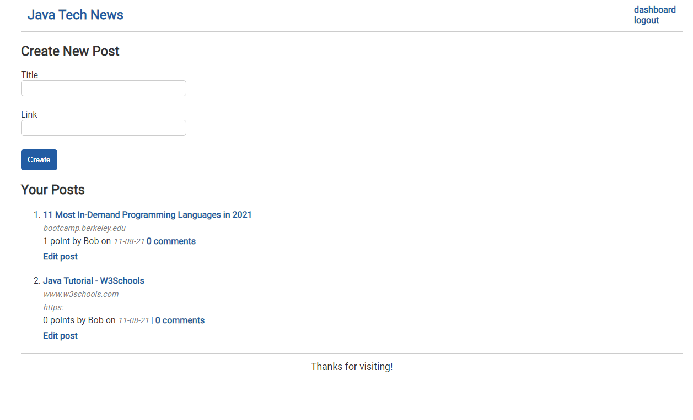

# Java Tech News

## Table of Contents

* [Description](#description)
* [Usage](#usage)
* [Credits](#credits)
* [License](#license)

## Description

Want to tell the world about tech news?

This blog site will give you a platform to share tech news with others. Simply sign-up for an account after clicking through login, then you'll be able to share new posts via the Dashboard's Create New Post form. Simply type in your title and the link to the news article you wish to share. After you've posted your knowledge, it'll show up on the home page where you can leave comments on other people's news links, too. You can edit or delete your post at any time by going back to the Dashboard and clicking on the post that needs modified.

Get ready to spread news and connect with the tech world through this helpful news site! 

This blog uses Java, JavaScript, HTML5, CSS3, Spring Boot, MySQL, and Thymeleaf. It's deployed on Heroku.

## Usage

Navigate to [Soma Mäkelä's Tech News Blog](https://java-tech-news.herokuapp.com/) and view the web page.

## Credits

Created by [Soma Mäkelä](https://github.com/smakela13).

## License

This website currently has No License, which means it is under exclusive copyright. No one can copy, distribute, or modify this website without permission.
